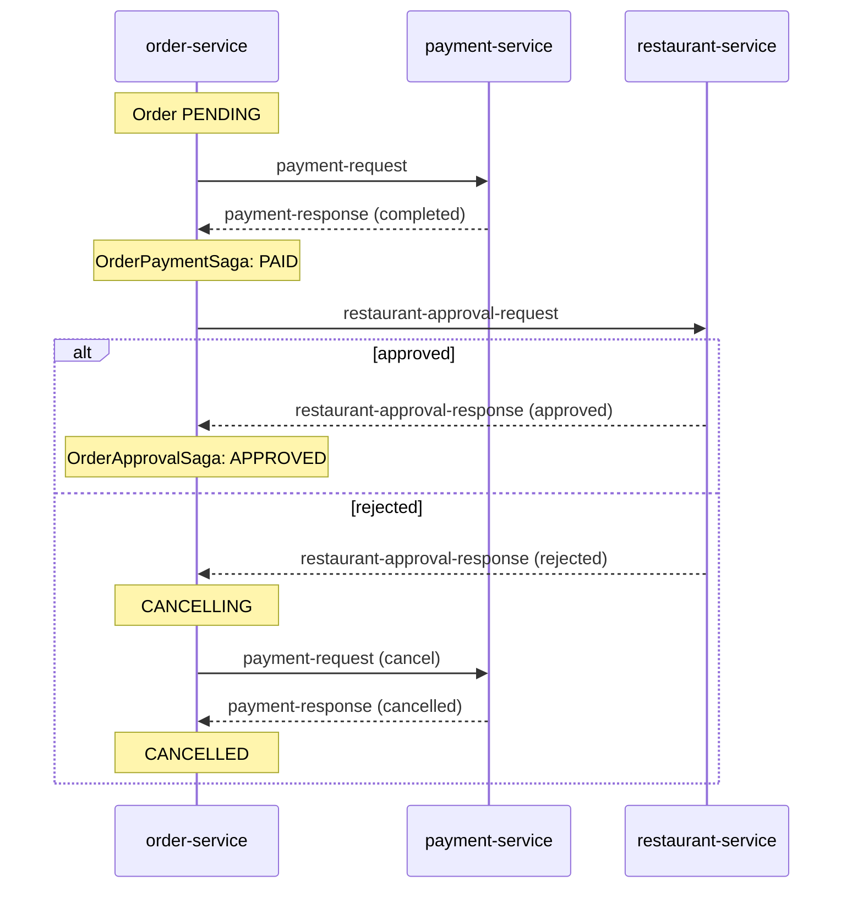

# Food Ordering System

A food-ordering back end made of four Java services (order, payment, restaurant, customer). Each service uses **hexagonal architecture and DDD**. A **saga** coordinates the order across payment and restaurant approval, and every service publishes through a **transactional outbox** to **Kafka** (Avro and Schema Registry).

> **Study project (April–May 2023)**, built while following an online course. It's written in Java and Spring Boot rather than .NET, but the patterns carry over directly.

## Order flow



Order states: `PENDING → PAID → APPROVED`, or `CANCELLING → CANCELLED` when a later step fails. The two saga steps are `OrderPaymentSaga` and `OrderApprovalSaga`, both implementing the `SagaStep` interface in [`infrastructure/saga`](infrastructure/saga).

## Transactional outbox

- Each service writes its outgoing messages to an outbox table in the same local transaction as the state change (for example the `payment_outbox` table in [`PaymentOutboxEntity.java`](order-service/order-dataaccess/src/main/java/org/food/ordering/system/order/service/dataaccess/outbox/payment/entity/PaymentOutboxEntity.java)).
- Scheduled publishers pick up pending rows, publish them to Kafka, and record the result ([`PaymentOutboxScheduler.java`](order-service/order-domain/order-application-service/src/main/java/org/food/ordering/system/order/service/domain/outbox/scheduler/payment/PaymentOutboxScheduler.java)). Cleaner schedulers remove completed rows.
- Outbox rows use optimistic locking (`@Version`). Tests cover double payment, including concurrent attempts with threads and a latch (`OrderPaymentSagaTest`, `PaymentRequestMessageListenerTest`).

## Service layout

Each service is split into Maven modules along hexagonal lines:

| Module | Contents |
|---|---|
| `*-domain-core` | Entities, value objects, domain events; no framework dependencies |
| `*-application-service` | Input and output ports, command handlers, sagas, outbox schedulers |
| `*-dataaccess` | JPA adapters (PostgreSQL, one schema per service) |
| `*-messaging` | Kafka publishers and listeners |
| `*-container` | Spring Boot application and configuration |

`customer-service` publishes customer events to the `customer` topic; `order-service` keeps its own copy of customer data (CQRS).

## Tech

Java 17 · Spring Boot 2.6 · Spring Data JPA · PostgreSQL · Kafka (3 brokers, ZooKeeper) · Avro · Schema Registry · Maven

## Running locally

```bash
cd infrastructure/docker-compose
docker compose -f common.yml -f zookeeper.yml up -d
docker compose -f common.yml -f kafka_cluster.yml up -d
docker compose -f common.yml -f init_kafka.yml up      # creates the 5 topics
```

You also need PostgreSQL on `localhost:5432`. Then build and start the four `*-container` applications:

```bash
mvn clean install
```

## How I would build it today

- **Spring Boot 3**, with Kafka in KRaft mode instead of ZooKeeper.
- **Testcontainers integration tests** that run the full saga, including the cancellation path, against real Kafka and PostgreSQL.
- **Trace context in Kafka headers** (OpenTelemetry), so a single order can be followed across all four services.
